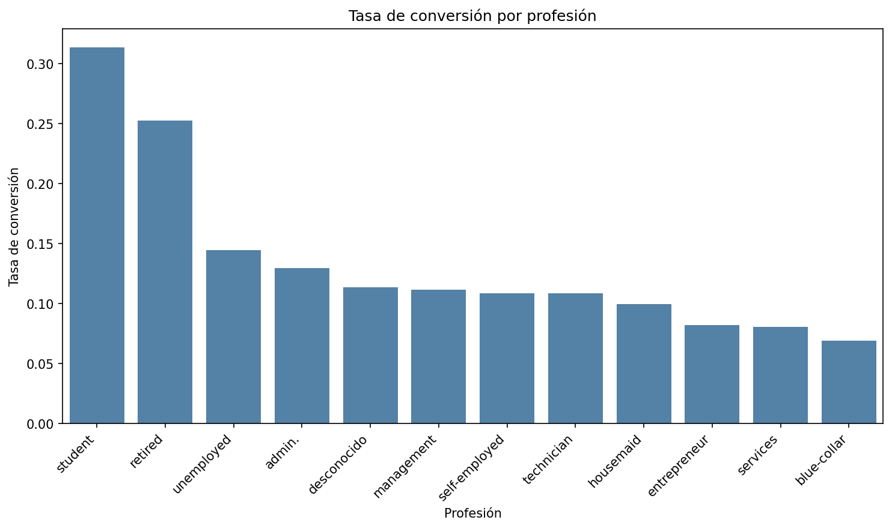

<div align="center">

# 🏦 EDA · Campañas de Marketing Bancario

### Análisis exploratorio de datos sobre una campaña de depósitos a plazo de un banco portugués

[](https://www.python.org/)
[](https://pandas.pydata.org/)
[](https://jupyter.org/)
[](https://seaborn.pydata.org/)
[]()
[]()

</div>

---

## 📖 Descripción del proyecto

Este proyecto analiza los datos de una campaña de marketing directo (por teléfono) de una institución bancaria portuguesa, cuyo objetivo era conseguir que sus clientes contrataran un **depósito a plazo fijo**.
Se combinan dos fuentes de datos el registro de cada llamada de la campaña y el perfil demográfico de los clientes, para responder a una pregunta central: **¿qué distingue a un cliente que contrata del que no?**
Todo el análisis, desde la limpieza hasta las visualizaciones, se ha desarrollado en Python dentro de un Jupyter Notebook, documentando cada decisión tomada durante el proceso.

---

## 🎯 Objetivos

- Limpiar y transformar dos datasets con problemas reales de calidad de datos (nulos, formatos inconsistentes, tipos incorrectos).
- Unificar ambas fuentes en un único dataset listo para el análisis.
- Identificar, con criterio estadístico, qué variables están más asociadas a la conversión.
- Visualizar los hallazgos de forma clara y accionable.
- Traducir el análisis en recomendaciones de negocio concretas.

---

## 🔍 Datos de partida

| Dataset | Filas | Columnas | Contenido |
|---|---|---|---|
| `bank-additional.csv` | 43.000 | 24 | Cada contacto telefónico de la campaña: datos demográficos, indicadores económicos y si el cliente contrató (`y`) |
| `customer-details.xlsx` | 43.170 (3 hojas: 2012 / 2013 / 2014) | 7 | Ingresos, composición familiar y comportamiento web de cada cliente |

Ambos datasets comparten **43.000 identificadores de cliente en común**, lo que permite combinarlos en un único dataset analizable.

---

## 📂 Estructura del repositorio

```
proyecto-eda-marketing/
│
├── README.md
├── DatosProyecto/
│   ├── bank-additional.csv        # datos en bruto de la campaña
│   ├── customer-details.xlsx      # datos en bruto de clientes (3 hojas)
│   └── datos_limpios.csv          # dataset final, limpio y unido
├── imagenes/                      # gráficos exportados del análisis
└── Notebook/
    └── analisis_marketing_bancario.ipynb
```

---

## 🛠️ Tecnologías utilizadas

| Herramienta | Uso en el proyecto |
|---|---|
| **Python 3** | Lenguaje base de todo el análisis |
| **pandas** | Limpieza, transformación, `groupby`, `merge` |
| **numpy** | Manejo de valores nulos (`np.nan`) |
| **matplotlib / seaborn** | Visualización de datos |
| **Jupyter Notebook (VSCode)** | Desarrollo interactivo del análisis |

---

## 🧭 Metodología

El análisis sigue el flujo clásico de un EDA, documentado paso a paso en el notebook:

```
Carga de datos  →  Exploración inicial  →  Limpieza y transformación
      →  Unión de datasets  →  Análisis descriptivo
      →  Visualización  →  Conclusiones e informe
```

Cada decisión de limpieza (por ejemplo, media vs. mediana para rellenar nulos) se toma **después de explorar los datos reales**, no por defecto (la justificación de cada elección está documentada en celdas Markdown dentro del notebook).

---

## 🧹 Limpieza y transformación de datos

- **Columnas sobrantes**: eliminado el índice duplicado `Unnamed: 0` de ambos datasets.
- **Tipos de datos incorrectos**: `cons.price.idx`, `cons.conf.idx`, `euribor3m` y `nr.employed` venían como texto por usar coma decimal en vez de punto; se corrigieron y convirtieron a numérico.
- **Valores nulos**, tratados con un criterio distinto según el tipo de variable:

  | Columna(s) | Estrategia | Motivo |
  |---|---|---|
  | `age` | Mediana | Robusta frente a edades extremas |
  | `default`, `housing`, `loan` | `-1` ("desconocido") | Variables binarias; no tiene sentido una media |
  | `job`, `marital`, `education` | `"Desconocido"` | Categóricas, mismo criterio |
  | `cons.price.idx`, `euribor3m` | Media | Indicadores económicos sin outliers relevantes |
  | `date` | Eliminación de filas (248, <1%) | Imposible "inventar" una fecha de contacto |

- **Formato de fechas**: `date` venía como texto en español (`"2-agosto-2019"`); se tradujo y convirtió a `datetime`, de donde se derivaron `contact_year` y `contact_month`.
- **Inconsistencias de texto**: `marital` y `poutcome` venían en MAYÚSCULAS mientras el resto de categóricas estaban en minúsculas; se unificó todo a minúsculas.
- **Variable centinela**: `pdays` usaba `999` como código de *"cliente nunca contactado antes"*, distorsionando cualquier estadística. Se creó la columna booleana `contactado_previamente` y se sustituyó el `999` por un nulo real.
- **Unión de datasets**: `merge` (inner join) por el identificador de cliente → dataset final de **42.752 filas y 31 columnas**, guardado en [`DatosProyecto/datos_limpios.csv`](DatosProyecto/datos_limpios.csv).

---

## 📊 Hallazgos del análisis

### 🕐 La duración de la llamada es el factor más determinante
Los clientes que contratan hablan de media **552 segundos**, frente a **220 segundos** de quienes no contratan más del doble. A mayor implicación en la conversación, mayor probabilidad de conversión.

### 🔁 Insistir más no ayuda
Contraintuitivamente, quienes contratan reciben **menos** contactos de media (2.05) que quienes no lo hacen (2.63). Quien va a decir que sí, suele decidirlo pronto.

### 💶 Los ingresos no influyen
La media de ingresos es prácticamente idéntica entre ambos grupos (93.297€ vs 92.660€), el poder adquisitivo no parece relevante para este producto.

### 🏆 El historial con el cliente es el mejor predictor
Los clientes cuya campaña anterior fue un éxito contratan en el **65.4%** de los casos, frente a solo el **8.8%** de quienes nunca fueron contactados antes casi **7.5 veces más**.

### 👩‍🎓 La profesión marca diferencias claras
`student` (31.4%) y `retired` (25.3%) son, con diferencia, los perfiles más receptivos; `blue-collar` (6.9%) el menos.

### 📅 Estacionalidad moderada
Octubre destaca con la mejor tasa de conversión (12.4%), con una caída notable el mes anterior, septiembre (10.2%). El resto del año se mantiene relativamente estable.

### 🔗 Correlaciones débiles entre variables numéricas
Solo `emp.var.rate` y `euribor3m` muestran una correlación fuerte (0.86), esperable al ser ambos indicadores macroeconómicos. Ninguna variable numérica se correlaciona fuertemente con la conversión — el comportamiento del cliente se explica mejor por variables categóricas (profesión, historial) que por magnitudes numéricas.

---

## 🖼️ Galería de visualizaciones

<table>
<tr>
<td width="50%">

**Tasa de conversión por profesión**


</td>
<td width="50%">

**Tasa de conversión por resultado de campaña anterior**


</td>
</tr>
<tr>
<td width="50%">

**Matriz de correlación**


</td>
<td width="50%">

**Distribución de la edad de los clientes**


</td>
</tr>
<tr>
<td width="50%">

**Duración de la llamada según conversión**


</td>
<td width="50%">

**Tasa de conversión por mes**


</td>
</tr>
</table>

---

## 💡 Recomendaciones de negocio

- 🎯 **Priorizar la calidad de la conversación sobre la cantidad de contactos** formar a los agentes para conseguir llamadas más largas y de mayor calidad, en vez de simplemente aumentar el número de intentos.
- 🔁 **Enfocar campañas futuras en clientes con historial previo de éxito**, con diferencia el segmento más receptivo.
- 👩‍🎓 **Explorar campañas específicas para estudiantes y jubilados**, dado su interés claramente superior al resto de perfiles.
- 📅 **Investigar qué ocurrió en octubre** para explicar el repunte de conversión, por si es replicable en otros meses del año.

---

## 🚀 Cómo ejecutar el proyecto

```bash
# 1. Clona el repositorio
git clone https://github.com/mgonzalezbenm/eda-marketing-bancario.git
cd eda-marketing-bancario

# 2. Instala las extensiones
pip install pandas numpy matplotlib seaborn openpyxl

# 3. Abre el notebook en VSCode
```

Abre `Notebook/analisis_marketing_bancario.ipynb` y ejecuta todas las celdas en orden (**Run All**). Las rutas de los datos son relativas a la carpeta `DatosProyecto/`.

---

## 🔮 Próximos pasos

- [ ] Entrenar un modelo predictivo (regresión logística / árbol de decisión) que estime la probabilidad de conversión de cada cliente.
- [ ] Analizar el impacto conjunto de `job` + `poutcome` mediante tablas cruzadas, para identificar micro-segmentos de alta conversión.
- [ ] Investigar en detalle qué cambió en la campaña durante octubre.
- [ ] Añadir un dashboard interactivo (Streamlit o Power BI) sobre el dataset limpio.
- [ ] Evaluar el uso de técnicas de balanceo de clases, dado que la conversión es un evento minoritario dentro del dataset.

---

## 🤝 Contribuciones

Este es un proyecto académico individual, pero está abierto a sugerencias. Si detectas algo que se pueda mejorar (una visualización, un enfoque de limpieza distinto, un hallazgo adicional), siéntete libre de abrir un *issue* o una *pull request*.

---

## 👩‍💻 Autora

**María González**
🔗 [github.com/mgonzalezbenm](https://github.com/mgonzalezbenm)

